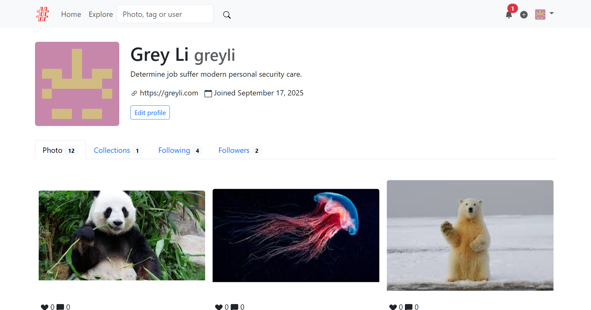

# Moments - ML-Enhanced Photo Sharing App

A photo sharing social networking app built with Python and Flask, enhanced with machine learning capabilities for automatic alternative text generation and object-based image search. The example application for the book *[Python Web Development with Flask (2nd edition)](https://helloflask.com/en/book/4)* (《[Flask Web 开发实战（第 2 版）](https://helloflask.com/book/4)》).

Demo: http://moments.helloflask.com



## New ML Features

This enhanced version includes:

- **Automatic Alternative Text Generation**: Uses BLIP (Bootstrapping Language-Image Pre-training) model to automatically generate descriptive alternative text for uploaded images, improving accessibility for screen readers and search engines.

- **Object-Based Image Search**: Uses YOLOS (You Only Look at One Sequence) model to detect objects in images, enabling users to search for photos by the objects they contain (e.g., "dog", "car", "person").

## Installation

Clone the repo:

```
$ git clone https://github.com/greyli/moments
$ cd moments
```

### Option 1: Using pip (Recommended)

Install dependencies with pip:

```bash
$ pip install -r requirements.txt
```

### Option 2: Using PDM

Install dependencies with [PDM](https://pdm.fming.dev):

```
$ pdm install
```

> [!TIP]
> If you don't have PDM installed, you can create a virtual environment with `venv` and install dependencies with `pip install -r requirements.txt`.

## Setup

To initialize the app, run the following commands:

```bash
# Initialize the database
$ python -c "from moments import create_app; app = create_app('development'); app.app_context().push(); from moments.core.extensions import db; db.create_all(); print('Database initialized')"

# Run database migration (adds ML fields)
$ python migrate_db.py
```

If you just want to try it out, generate fake data with `flask lorem` command then run the app:

```
$ flask lorem
```

It will create a test account:

* email: `admin@helloflask.com`
* password: `moments`

Now you can run the app:

```
$ flask run
* Running on http://127.0.0.1:5000/
```

## ML Dependencies

The ML features require additional packages that are included in the requirements.txt:

- `torch`: PyTorch for deep learning models
- `transformers`: Hugging Face transformers library for pre-trained models
- `pillow`: Image processing
- `requests`: HTTP requests for model downloads

**Note**: On first run, the models will be downloaded automatically. This may take several minutes depending on your internet connection. The models are cached locally for subsequent runs.

## Usage

### Alternative Text Generation

When you upload a photo, the system automatically:
1. Analyzes the image using the BLIP model
2. Generates descriptive alternative text
3. Stores the text in the database
4. Includes it in the HTML `alt` attribute for accessibility
5. **Auto-populates the photo description** if you don't provide one

**Smart Description Logic:**
- If you provide a description during upload → Your description is used
- If you leave the description empty → AI-generated description is automatically added
- This ensures every photo has a meaningful description for better user experience

### Object-Based Search

You can search for photos by objects they contain:
1. Go to the search page
2. Select "Objects (ML)" tab
3. Enter keywords like "dog", "car", "person", etc.
4. The system will find photos containing those objects

## Technical Details

- **Caption Model**: Salesforce/blip-image-captioning-base
- **Object Detection Model**: hustvl/yolos-tiny
- **Database**: SQLite with additional fields for ML data
- **Search**: Enhanced search functionality using both text and object detection

## License

This project is licensed under the MIT License (see the
[LICENSE](LICENSE) file for details).
